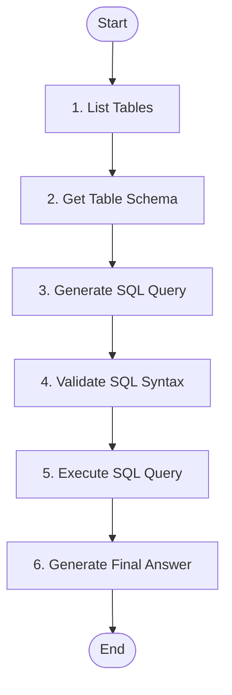

# Conversational SQL Agent

A Conversational SQL Agent built using **LangGraph**, **LangChain**, and **FastAPI**, with a **Gradio** web interface. This application allows users to query relational databases in natural language by automatically discovering table schemas, generating and validating SQL queries, and returning data-backed answers.

---

##  Key Features

- **Graph-Based Flow**: Uses LangGraph to implement a stateful control flow that manages the agent decision-making process and tool execution.
- **LLM Provider Support**: Supports local models using **Ollama** and remote models using **Hugging Face** endpoints.
- **Database Ingestion**: Supports local SQLite database files, remote SQLite database downloads, and connection URIs (such as PostgreSQL or MySQL).
- **SQL Query Validation**: Passes generated SQL queries through a checker node to validate syntax before execution.
- **Backend & Frontend Components**: Features a FastAPI backend API and a Gradio chatbot frontend interface.

---

## Project Structure

Here is the layout of the SQL Agent project:

```text
├── api/
│   └── main.py                     # FastAPI application exposing connectivity and query endpoints
├── build_graph/
│   ├── graph.py                    # Orchestrates the LangGraph state machine flow
│   ├── state.py                    # Defines the TypedDict state tracking the conversation history
│   ├── nodes/
│   │   ├── agent_node.py           # Handles LLM reasoning, prompting, and tool binding
│   │   └── tool_node.py            # Executes LLM-chosen tools dynamically
│   └── tool/
│       ├── get_schema.py           # Tool: Inspects schema for specific tables
│       ├── list_tables.py          # Tool: Lists all available database tables
│       ├── query_checker.py        # Tool: Validates SQL syntax and safety checks
│       └── run_query.py            # Tool: Safely executes queries on the database
├── db_ingestion/
│   └── ingestion.py                # Ingestion service for SQLite files, URLs, and DB engines
├── downloaded_dbs/                 # Cache directory for databases downloaded via URLs
├── frontend/
│   └── app.py                      # Gradio web frontend interface
├── models/
│   └── llm.py                      # Singleton manager for Ollama and Hugging Face providers
├── notebook/
│   └── sql_agent.ipynb             # Jupyter Notebook for testing the LangGraph pipeline
├── pyproject.toml                  # Python packaging & dependencies configuration
├── template.py                     # Python script to scaffold/verify the project structure
└── .env                    # Sample environment variables file
```

---

##  Agent Workflow

The agent uses a cyclic state graph to query databases safely and accurately:



1. **List Tables (`sql_db_list_tables`)**: Identifies available tables in the target database.
2. **Get Schema (`sql_db_schema`)**: Inspects columns, keys, and constraints only for the tables relevant to the user query.
3. **Generate SQL Query**: Builds a specific SQL query using schema context.
4. **Validate Query (`sql_db_query_checker`)**: Inspects query syntax to prevent SQL errors.
5. **Run Query (`sql_db_query`)**: Executes the SQL statement and returns the rows.
6. **Generate Answer**: Formulates a friendly, natural language answer using the database results.

---

##  Setup & Installation

### 1. Prerequisites
- **Python**: version `3.13` or higher.
- **uv** (recommended) or **pip**: for dependency management.

### 2. Install Dependencies
Clone the repository and install the dependencies.

Using `uv` (recommended):
```bash
uv sync
```

Or using standard `pip`:
```bash
pip install -r pyproject.toml
```

### 3. Environment Configuration
Create a `.env` file at the root of the project to configure your access keys.

```bash
HF_TOKEN=your_huggingface_api_token_here


SQL_AGENT_API_URL=http://127.0.0.1:8000
```

---

##  Running the Application

To run the complete system, start the **FastAPI Backend** first, followed by the **Gradio Frontend**.

### Step 1: Start the Backend API
The backend exposes connection tests and execution endpoints. Run it using:
```bash
uv run python api/main.py
```
*The API will be available at [http://127.0.0.1:8000](http://127.0.0.1:8000).*

### Step 2: Start the Gradio Web UI
The frontend provides a user-friendly chatbot interface to select and query databases. Run it in a separate terminal using:
```bash
uv run python frontend/app.py
```
*The Web UI will be available at [http://127.0.0.1:7860](http://127.0.0.1:7860).*

---

##  Example Usage

Once the web application is running:
1. Open the web interface in your browser.
2. Under **Source Type**, select `local` or `url`.
3. Provide a path or connection URL in the **Source** field:
   - For a local SQLite database, you can use `notebook/Chinook.db` (or upload one to the `db_ingestion/` directory).
   - Alternatively, use a PostgreSQL connection URI.
4. Click **Connect Database** to verify connection.
5. Enter natural language queries into the chat box, such as:
   - *"Which artist has the most albums?"*
   - *"What are the top 5 longest tracks?"*
   - *"How many invoices were billed in each country?"*
